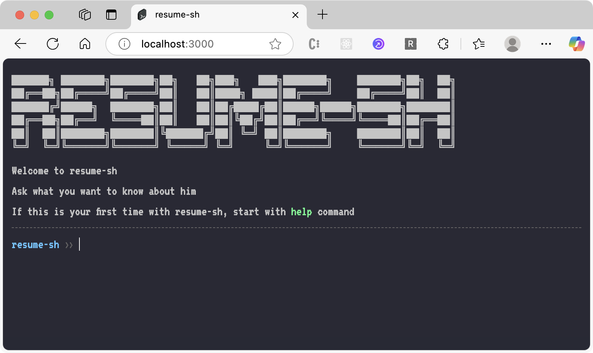

<div align="center">
  <a href="https://github.com/IwannabeRealnerD/resume-sh">
    
  </a>

  <h2 align="center">resume-sh</h2>
</div>

<div align="center">
    <a href="https://iwannaberealnerd.github.io/resume-sh/">Deployed Link</a>
    ·
    <a href="https://github.com/IwannabeRealnerD/resume-sh/issues">Report Bug</a>
    ·
    <a href="https://github.com/IwannabeRealnerD/resume-sh/issues">Request Feature</a>
</div>

<div align="center">
  <p> A resume that isn't boring, and a way to showcase yourself through an interactive terminal. resume-sh<s>(not zsh)</s>(resume shell)
  </p>
  
  
  
  
</div>
<br/>
<div align="center">

</div>

## About this project

- This project is a resume that has a terminal-like user interface.
- Users can interact with the project by typing custom commands, such as visit github repository or visit blog.
- Fully customizable commands and welcome messages.
- There is a project that is forked from this project and has similar features and design but for wedding invitation.

### Available Commands
 - Please check the [src/settings.ts](src/settings.ts) for available commands.
 - You can add your own commands by adding them to the `commands` object in the [src/settings.ts](src/settings.ts) file.

 ### Fonts
 - The goal of this project is to achieve a terminal-like design, so a pixel-style font was added to enhance that visual effect.
 - The default font is VT323 from Google Fonts. However, since this font supports only English, DungGeunMo was additionally added to support Korean text, as it offers a similar visual style.
 - If any language other than Korean or English is to be used, a font with a similar design must be added to the project.

## Deployed link
- [github pages](https://iwannaberealnerd.github.io/resume-sh/)
- The GitHub Pages deployment is the actual resume invitation webpage that I personally used.


## Getting started in your local environment
- To get started with this project, you need to clone the repository and install the dependency.

### Environment Setup
- nodejs - 22.14.0
- pnpm - 10.6.2
  ```sh
  corepack prepare pnpm@9.13.0 --activate
  ```

### How to Deploy Dev Server
1. Clone repository
   ```sh
   git clone https://github.com/IwannabeRealnerD/resume-sh.git
   ```
2. Install pnpm dependency
   ```sh
   pnpm install --frozen-lockfile
   ```
3. Start Dev Server
   ```sh
   pnpm dev
   ```

## Contact
iwannaberealnerd - iwannaberealnerd@gmail.com

## License

This project is licensed under the MIT License - see the [LICENSE](LICENSE) file for details.